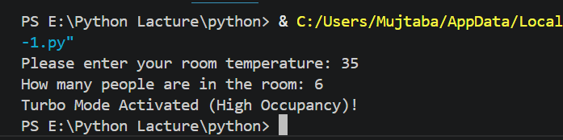
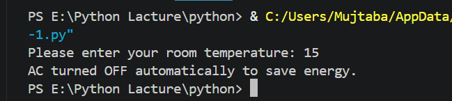
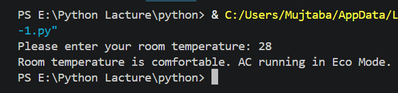

# Smart Home AC Controller Simulation

> A Python-based IoT-inspired automation system that controls AC based on room temperature and occupancy.

---

# About the Project

This mini project simulates how a **smart home AC system** makes decisions automatically — just like real IoT devices. Built using Python conditional logic to handle different temperature and occupancy scenarios.

---

# How It Works

| Condition | Action |
|-----------|--------|
| Temperature ≥ 45°C | Critical Heat — AC at Maximum Power |
| Temperature ≥ 30°C + 5 or more people | Turbo Mode Activated |
| Temperature ≥ 30°C + less than 5 people |  Normal Mode (22°C) |
| Temperature < 20°C |  AC turns OFF (Energy Saving) |
| Otherwise |  Eco Mode runs |

---

# Sample Output

---

# How to Run

1. Make sure Python is installed on your system
2. Clone this repository:
   `git clone https://github.com/ahmad-mujtaba648/smart-home-ac-controller.git`
3. Navigate to the folder and run:
   `python project-1.py`

---

# Concepts Practiced

- `if / elif / else` statements
- Nested conditional logic
- Multiple user inputs
- Real-world problem solving
- Basic IoT automation thinking

---

## 💻 Tech Stack

---

# Author

**Ahmad Mujtaba** 
CS Student @ UET Lahore | Aspiring Cybersecurity & AI Engineer  

